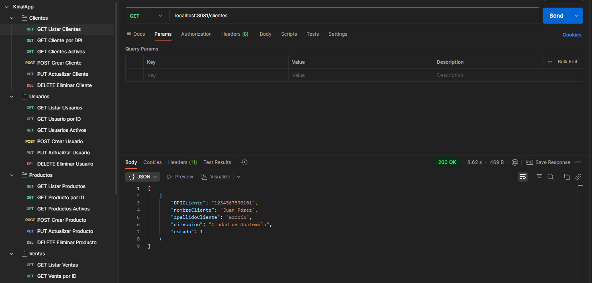
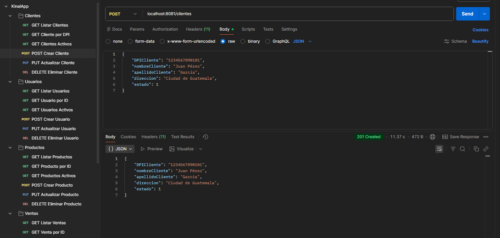
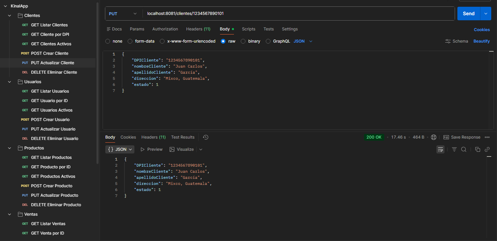
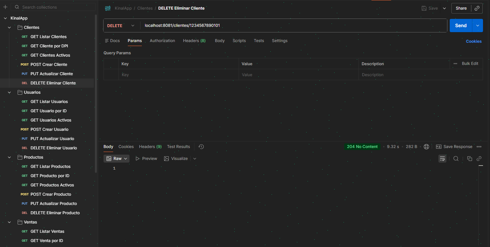

# KinalApp

API REST desarrollada con Spring Boot para la gestión de clientes, usuarios, productos, ventas y detalle de ventas.

## Tecnologías Utilizadas

* **Java 21**
* **Spring Boot 4.0.2**
* **Maven** (Gestor de dependencias)
* **MySQL** (Sistema Gestor de Base de Datos)
* **Spring Data JPA / Hibernate**
* **Spring Security** (Autenticación Basic Auth)

## Requisitos Previos

Antes de ejecutar la aplicación, asegúrese de tener instalado:

* JDK 21 o superior
* Maven 3.8 o superior
* MySQL Server activo en el puerto `3306`
* Postman (para probar los endpoints)

## Configuración de la Base de Datos

La aplicación crea la base de datos automáticamente si no existe. Actualice las credenciales en `src/main/resources/application.properties`:

```properties
spring.datasource.url=jdbc:mysql://localhost:3306/dbClientes_in5am?createDatabaseIfNotExist=true
spring.datasource.username=root
spring.datasource.password=SU_CONTRASEÑA
server.port=8081
```

## Instalación y Ejecución

1. Clonar el repositorio:
```bash
git clone https://github.com/hgarcia-2023541/KinalApp.git
```

2. Ingresar a la carpeta del proyecto:
```bash
cd KinalApp
```

3. Compilar el proyecto:
```bash
mvn clean install
```

4. Ejecutar la aplicación:
```bash
mvn spring-boot:run
```

La aplicación estará disponible en: `http://localhost:8081`

## Seguridad

Todos los endpoints requieren autenticación **Basic Auth**. Use las siguientes credenciales en Postman:

| Usuario | Contraseña | Rol   |
|---------|------------|-------|
| admin   | admin123   | ADMIN |
| user    | user123    | USER  |

En Postman: pestaña **Authorization** → Type: **Basic Auth** → ingrese usuario y contraseña.

## Endpoints Disponibles

| Entidad      | Método | Endpoint                          | Descripción              |
|--------------|--------|-----------------------------------|--------------------------|
| Cliente      | GET    | /clientes                         | Listar todos             |
| Cliente      | GET    | /clientes/{dpi}                   | Buscar por DPI           |
| Cliente      | GET    | /clientes/activos                 | Listar activos           |
| Cliente      | POST   | /clientes                         | Crear cliente            |
| Cliente      | PUT    | /clientes/{dpi}                   | Actualizar cliente       |
| Cliente      | DELETE | /clientes/{dpi}                   | Eliminar cliente         |
| Usuario      | GET    | /usuarios                         | Listar todos             |
| Usuario      | GET    | /usuarios/{id}                    | Buscar por ID            |
| Usuario      | GET    | /usuarios/activos                 | Listar activos           |
| Usuario      | POST   | /usuarios                         | Crear usuario            |
| Usuario      | PUT    | /usuarios/{id}                    | Actualizar usuario       |
| Usuario      | DELETE | /usuarios/{id}                    | Eliminar usuario         |
| Producto     | GET    | /productos                        | Listar todos             |
| Producto     | GET    | /productos/{id}                   | Buscar por ID            |
| Producto     | GET    | /productos/activos                | Listar activos           |
| Producto     | POST   | /productos                        | Crear producto           |
| Producto     | PUT    | /productos/{id}                   | Actualizar producto      |
| Producto     | DELETE | /productos/{id}                   | Eliminar producto        |
| Venta        | GET    | /ventas                           | Listar todas             |
| Venta        | GET    | /ventas/{id}                      | Buscar por ID            |
| Venta        | GET    | /ventas/activos                   | Listar activas           |
| Venta        | POST   | /ventas                           | Crear venta              |
| Venta        | PUT    | /ventas/{id}                      | Actualizar venta         |
| Venta        | DELETE | /ventas/{id}                      | Eliminar venta           |
| DetalleVenta | GET    | /detalle-venta                    | Listar todos             |
| DetalleVenta | GET    | /detalle-venta/{id}               | Buscar por ID            |
| DetalleVenta | GET    | /detalle-venta/venta/{id}         | Buscar por venta         |
| DetalleVenta | POST   | /detalle-venta                    | Crear detalle            |
| DetalleVenta | PUT    | /detalle-venta/{id}               | Actualizar detalle       |
| DetalleVenta | DELETE | /detalle-venta/{id}               | Eliminar detalle         |

## Pruebas con Postman

La colección de Postman está disponible en la carpeta `postman/` del repositorio. Impórtela directamente en Postman para tener todos los endpoints listos.

### GET — Listar Clientes (200 OK)


### POST — Crear Cliente (201 Created)


### PUT — Actualizar Cliente (200 OK)


### DELETE — Eliminar Cliente (204 No Content)


## Estructura del Proyecto

```
src/
└── main/
    ├── java/com/herbertgarcia/kinalapp/
    │   ├── config/
    │   │   └── SecurityConfig.java
    │   ├── controller/
    │   ├── entity/
    │   ├── repository/
    │   └── service/
    └── resources/
        └── application.properties
```

## Autor

**Herbert García** — `hgarcia-2023541@kinal.edu.gt`
