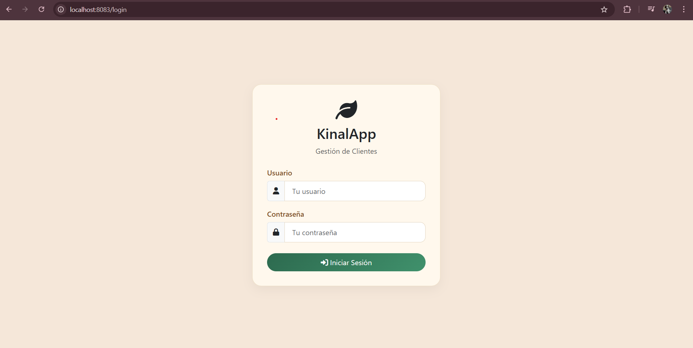
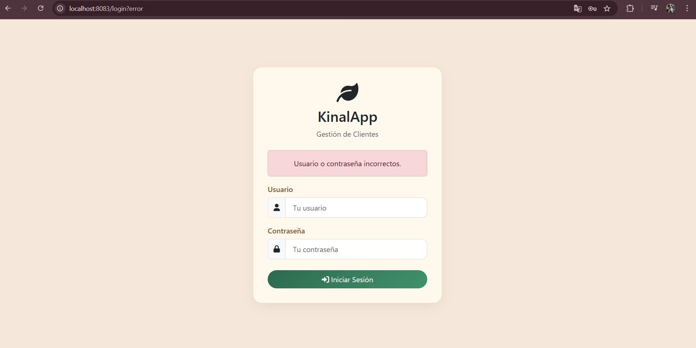
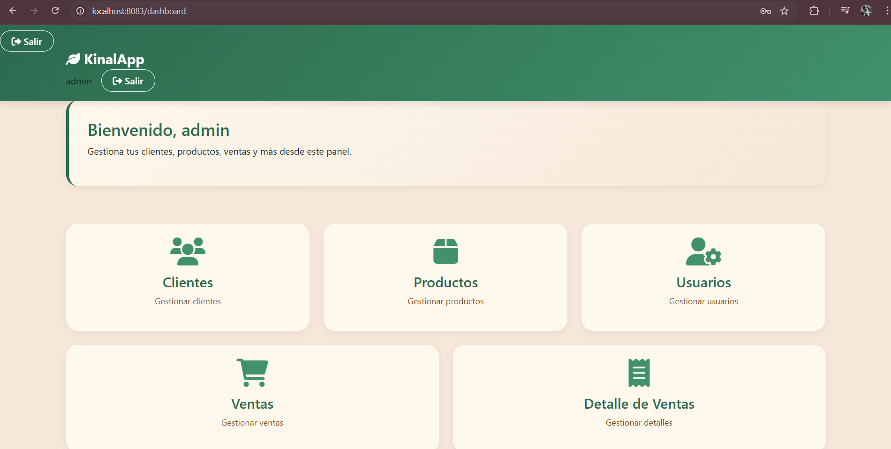
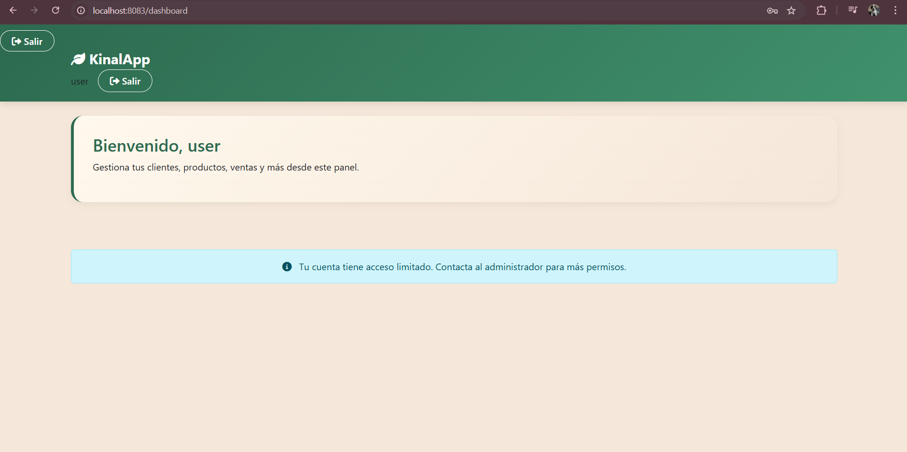
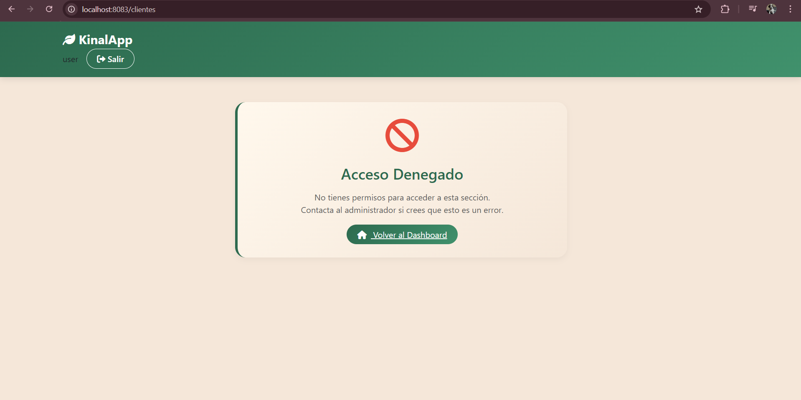
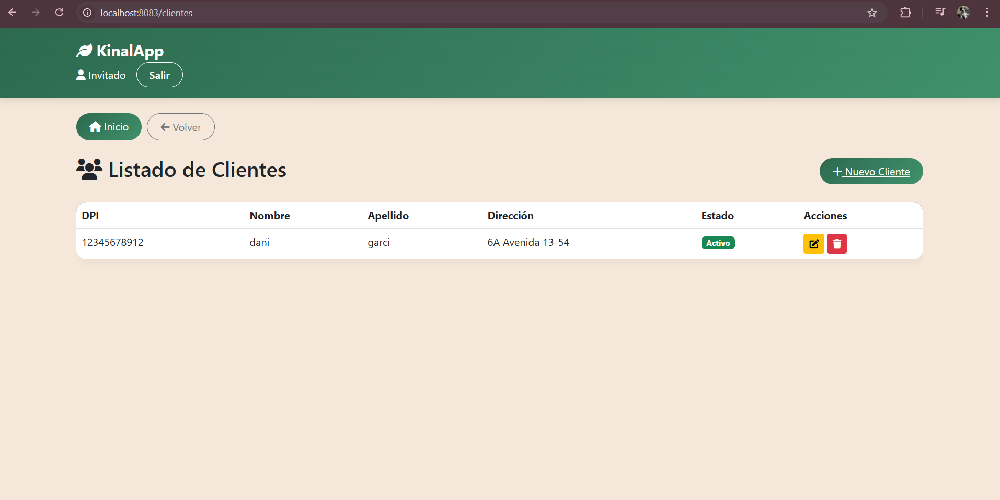

# KinalApp

Aplicación web desarrollada con Spring Boot para la gestión de clientes, usuarios, productos, ventas y detalle de ventas. Incluye autenticación y control de acceso por roles con Spring Security.

## Tecnologías Utilizadas

- Java 21
- Spring Boot 4.0.2
- Maven
- MySQL 8
- Spring Data JPA / Hibernate
- Spring Security
- Thymeleaf + Bootstrap 5

## Requisitos Previos

Antes de ejecutar la aplicación asegúrate de tener instalado:

- [JDK 21](https://adoptium.net/)
- [Maven 3.8+](https://maven.apache.org/)
- [MySQL Server 8](https://dev.mysql.com/downloads/)
- [IntelliJ IDEA](https://www.jetbrains.com/idea/) (recomendado)

## Configuración Paso a Paso

### 1. Clonar el repositorio

```bash
git clone https://github.com/hgarcia-2023541/KinalApp.git
cd KinalApp
```

### 2. Configurar MySQL

Abre MySQL Workbench o tu cliente preferido y crea el usuario de la base de datos:

```sql
CREATE USER 'IN5AM'@'localhost' IDENTIFIED BY 'tu_contraseña';
GRANT ALL PRIVILEGES ON dbClientes_in5am.* TO 'IN5AM'@'localhost';
FLUSH PRIVILEGES;
```

> La base de datos `dbClientes_in5am` se crea automáticamente al ejecutar la app.

### 3. Configurar application.properties

Edita el archivo `src/main/resources/application.properties` con tus credenciales:

```properties
spring.datasource.url=jdbc:mysql://localhost:3306/dbClientes_in5am?createDatabaseIfNotExist=true
spring.datasource.username=IN5AM
spring.datasource.password=TU_CONTRASEÑA
server.port=8083
spring.jpa.hibernate.ddl-auto=update
```

### 4. Compilar el proyecto

```bash
mvn clean install
```

### 5. Ejecutar la aplicación

```bash
mvn spring-boot:run
```

O desde IntelliJ: clic en el botón ▶ Run sobre `KinalappApplication.java`.

### 6. Acceder a la aplicación

Abre tu navegador y ve a:

http://localhost:8083

Serás redirigido automáticamente al formulario de login.

## Seguridad y Control de Acceso

### Credenciales de prueba

| Usuario | Contraseña | Rol   |
|---------|------------|-------|
| admin   | admin      | ADMIN |
| user    | 12345      | USER  |

### Rutas públicas (sin autenticación)

| Ruta | Descripción |
|------|-------------|
| `/login` | Formulario de inicio de sesión |
| `/css/**` | Archivos de estilos |
| `/js/**` | Archivos JavaScript |

### Rutas protegidas por rol

| Ruta | Rol requerido | Descripción |
|------|--------------|-------------|
| `/dashboard` | USER, ADMIN | Panel principal |
| `/clientes/**` | ADMIN | Gestión de clientes |
| `/productos/**` | ADMIN | Gestión de productos |
| `/usuarios/**` | ADMIN | Gestión de usuarios |
| `/ventas/**` | ADMIN | Gestión de ventas |
| `/detalle-ventas/**` | ADMIN | Gestión de detalles |

### Comportamiento por rol

- **ADMIN**: Ve todos los paneles en el dashboard y puede acceder y gestionar todas las entidades.
- **USER**: Accede al dashboard pero no ve los paneles de gestión. Si intenta acceder directamente a una ruta protegida, recibe una página de error 403.

## Capturas de Pantalla

### Formulario de Login


### Login con credenciales incorrectas


### Dashboard - ADMIN


### Dashboard - USER


### Acceso denegado (403) - USER intenta entrar a /clientes


### Acceso exitoso - ADMIN en /clientes


## Endpoints REST Disponibles

| Entidad | Método | Endpoint | Descripción |
|---------|--------|----------|-------------|
| Cliente | GET | `/clientes` | Listar todos |
| Cliente | GET | `/clientes/{dpi}` | Buscar por DPI |
| Cliente | GET | `/clientes/activos` | Listar activos |
| Cliente | POST | `/clientes` | Crear cliente |
| Cliente | PUT | `/clientes/{dpi}` | Actualizar cliente |
| Cliente | DELETE | `/clientes/{dpi}` | Eliminar cliente |
| Usuario | GET | `/usuarios` | Listar todos |
| Usuario | GET | `/usuarios/{id}` | Buscar por ID |
| Usuario | GET | `/usuarios/activos` | Listar activos |
| Usuario | POST | `/usuarios` | Crear usuario |
| Usuario | PUT | `/usuarios/{id}` | Actualizar usuario |
| Usuario | DELETE | `/usuarios/{id}` | Eliminar usuario |
| Producto | GET | `/productos` | Listar todos |
| Producto | GET | `/productos/{id}` | Buscar por ID |
| Producto | GET | `/productos/activos` | Listar activos |
| Producto | POST | `/productos` | Crear producto |
| Producto | PUT | `/productos/{id}` | Actualizar producto |
| Producto | DELETE | `/productos/{id}` | Eliminar producto |
| Venta | GET | `/ventas` | Listar todas |
| Venta | GET | `/ventas/{id}` | Buscar por ID |
| Venta | GET | `/ventas/activos` | Listar activas |
| Venta | POST | `/ventas` | Crear venta |
| Venta | PUT | `/ventas/{id}` | Actualizar venta |
| Venta | DELETE | `/ventas/{id}` | Eliminar venta |
| DetalleVenta | GET | `/detalle-ventas` | Listar todos |
| DetalleVenta | GET | `/detalle-ventas/{id}` | Buscar por ID |
| DetalleVenta | POST | `/detalle-ventas` | Crear detalle |
| DetalleVenta | PUT | `/detalle-ventas/{id}` | Actualizar detalle |
| DetalleVenta | DELETE | `/detalle-ventas/{id}` | Eliminar detalle |

## Pruebas con Postman

La colección de Postman está disponible en la carpeta `postman/` del repositorio. Impórtala directamente en Postman para tener todos los endpoints listos.

## Estructura del Proyecto
src/
└── main/
├── java/com/herbertgarcia/kinalapp/
│   ├── config/
│   │   └── SecurityConfig.java
│   ├── controller/
│   │   ├── AuthController.java
│   │   ├── ClienteController.java
│   │   ├── ClienteViewController.java
│   │   └── ...
│   ├── entity/
│   ├── repository/
│   └── service/
└── resources/
├── templates/
│   ├── login.html
│   ├── dashboard.html
│   ├── 403.html
│   ├── clientes/
│   ├── productos/
│   ├── usuarios/
│   ├── ventas/
│   └── detalle-ventas/
├── static/
│   ├── css/
│   └── js/
└── application.properties

## Autor

Herbert García — hgarcia-2023541@kinal.edu.gt
